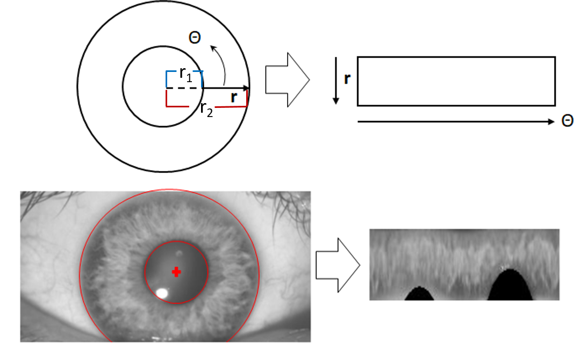
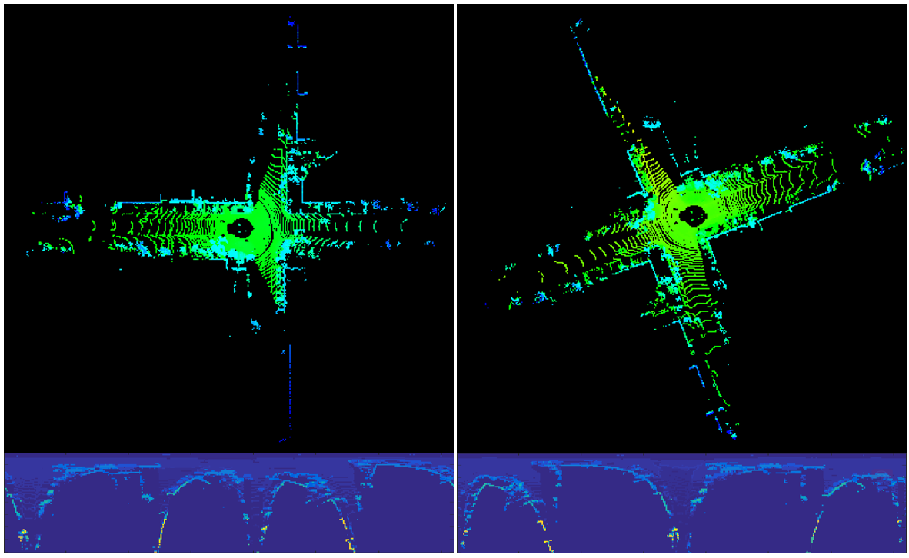
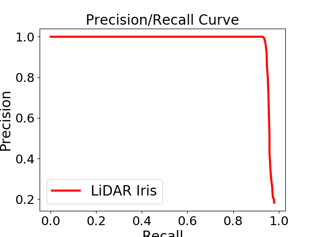
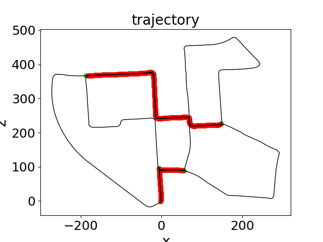
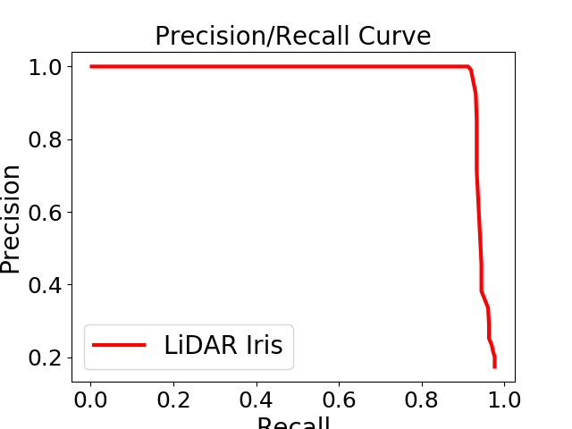
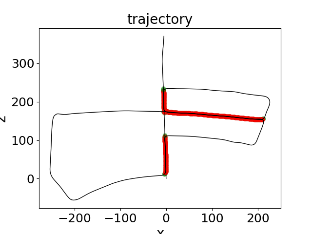
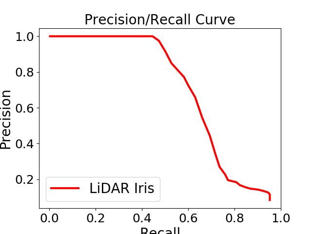
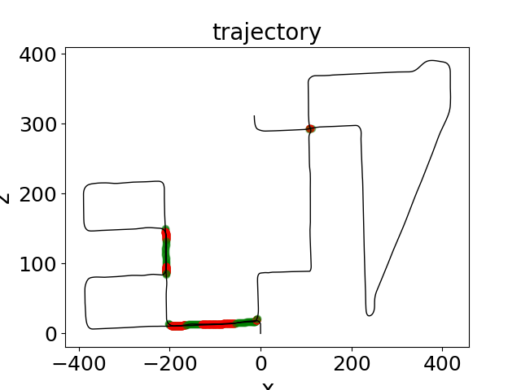

# LiDAR Iris for Loop-Closure Detection

Our reimplemented c++ code for our IROS2020 paper "LiDAR Iris for Loop-Closure Detection".
|||
|--|--|
| | |
|||
## Publication

Ying Wang, Zezhou Sun, Cheng-Zhong Xu, Sanjay Sarma, Jian Yang, and Hui Kong, **LiDAR Iris for Loop-Closure Detection**, _IEEE International Conference on Intelligent Robotics and Systems (IROS) 2020_. 


## Usage
#### 1. Requirement
```
1. cmake
2. PCL
3. OpenCV
```

#### 2. Build
```
cd ${YOUR_PROJECT_DIR}
mdkir build
cd build
cmake ..
make
```

#### 3. Run
```
./demo
python draw.py
```
|||
|--|--|
| | |
| | |
| | |
|||